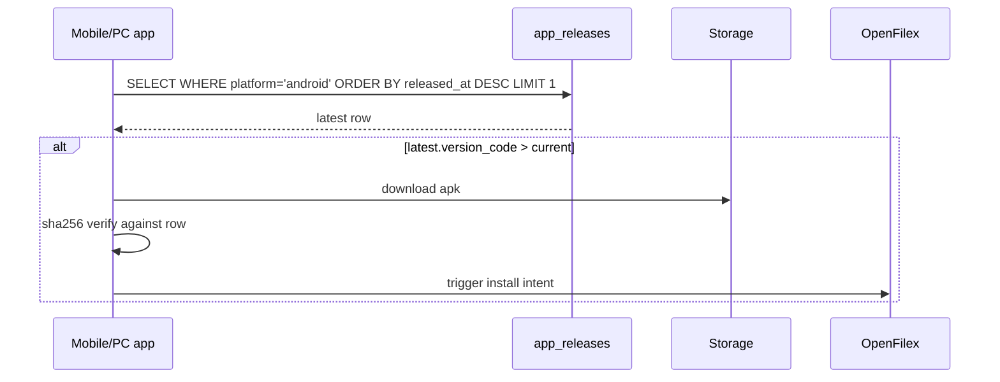

# app_releases

Self-hosted app distribution table. One row per release per platform. The in-app updater polls this to detect new versions.

## Schema (key columns)

| Column | Type |
|---|---|
| id | uuid PK |
| platform | text (android / windows / ios) |
| version_name | text (e.g. "3.7.6") |
| version_code | int (e.g. 61) |
| download_url | text (Storage URL or external) |
| sha256 | text (hex digest, for verify) |
| release_notes | text |
| is_critical | bool (forces install) |
| released_at | timestamptz |

## CRUD locations

- **Inserted** by [[publish_release.ps1]] (Android) and [[publish_windows.ps1]] (Windows)
- **Read** by [[apk-download-gate]] edge function (finds latest android row)
- **Read** by [[update_service.dart]] (in-app updater)
- **Read** by [[app_release_meta]] RPC

## In-app update flow

## Storage

APK / MSIX files live in `app-releases` Supabase Storage bucket. Bucket allows LIST=off but direct object read remains so in-app updater can fetch.

## See also

- [[apk_downloads]] — gated download audit log
- [[update_service.dart]]
- [[Workflow - Release]]
