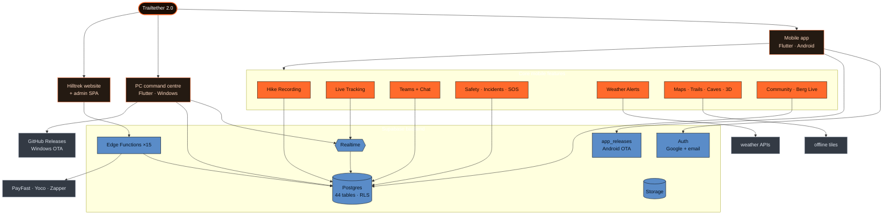
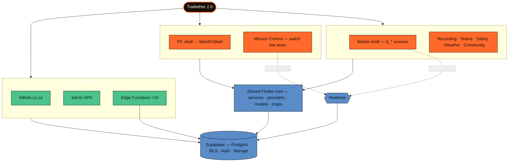

# Feature Map

A **structured, top-down** view of Trailtether — the clean-hierarchy alternative to the force-directed graph (which can only ever be a "nest"). Renders natively in Obsidian. Change `flowchart TD` → `LR` for a left-to-right (horizontal) version.

Reading it: three **surfaces** branch from the product; the mobile app owns the **core features** (ember); they persist to the **Supabase backend** (blue); the website drives **edge functions + payments**; the two **OTA channels** are explicit — Android via `app_releases`, Windows via GitHub Releases. Colours match the graph colour groups.

## Split by surface (three apps, connections kept)

The three surfaces as **distinct groups**, with every shared connection drawn — note that **Android + Windows are the same Flutter codebase** (different shells), so they meet at a *shared core*; the **website** is separate code; all three converge on **Supabase**, and live tracking links mobile → Realtime → the PC watcher.

The dashed lines are the **cross-surface link** you care about — the mobile app publishes GPS into Realtime and the Windows command centre watches it. Splitting the boxes doesn't break that; it makes it visible.

## Getting a hierarchy view (not a nest) in Obsidian

| Want | Use | Status |
|---|---|---|
| **A controlled diagram** | The **Mermaid** map above — edit it to add/move nodes; exact, no nest | ✅ here |
| **An interactive tree of your real notes** | **ExcaliBrain** — palette → *ExcaliBrain: Open* | ✅ dialled in (below) |
| Interactive force-free graph | **Juggl** plugin (`dagre` hierarchical layout) | needs install |
| Overview-only | Core **Graph View** with colour groups | force-directed; will stay a "nest" |

### ExcaliBrain — now tuned for hierarchy
Config changed in `.obsidian/plugins/excalibrain/data.json` (reload Obsidian to apply):
- `inferAllLinksAsFriends: false` — links now read as **parent/child** (a tree), not sideways "friends" (a mesh). This was the cause of the web.
- `showAttachments: false`, `showVirtualNodes: false` — drop image + unresolved-link clutter.

The tree is built from the existing **[[Home]] → section Index → doc** link backbone, so opening Home (or any index) in ExcaliBrain shows a clean top-down hierarchy. To force a specific parent on any note, add `up: "[[Parent Note]]"` to its frontmatter (ExcaliBrain reads `up`/`parent`/`source` as parent fields).
