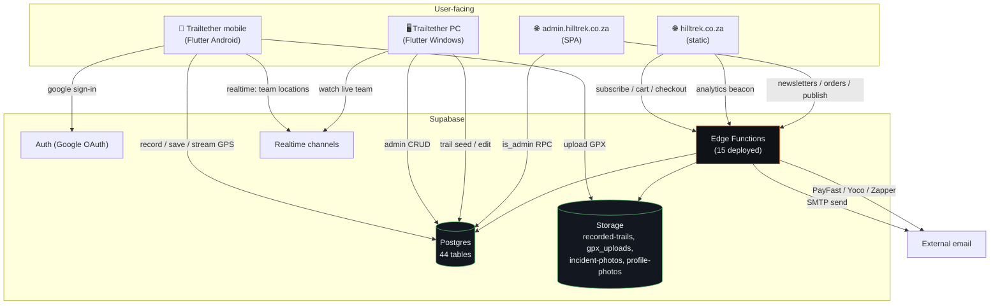

# System Overview

Three user-facing surfaces talking to one Supabase backend.

## Surfaces

| Surface | Stack | Entry | Live URL |
|---|---|---|---|
| Trailtether mobile + PC | Flutter | [[main.dart]] → [[AuthGate]] → [[AppShell]] (mobile) \| [[MainPcShell]] (desktop) | self-hosted APK + MSIX |
| Hilltrek public site | Vanilla HTML/JS | [[Hilltrek Site Module]] | hilltrek.co.za |
| Hilltrek admin | Vanilla JS SPA | [[Hilltrek Admin Module]] (`app.js`) | admin.hilltrek.co.za |
| Backend | Supabase (Postgres + Deno) | [[Supabase Migrations Module]], [[Supabase Functions Module]] | xuqmdujupbmxahyhkdwl.supabase.co |

## Key design decisions

- **Single Supabase project for everything.** Trailtether app, Hilltrek site, and admin SPA all share one Postgres + Auth + Storage. RLS does the heavy lifting. Admin operations gated by [[is_admin]] (allowlist in [[admin_users]]).
- **Self-hosted APK distribution.** Mobile updates aren't from Play Store — [[Workflow - Release]] publishes APKs to Supabase Storage; the in-app updater (see [[update_service.dart]]) downloads them after a SHA-256 verify. Web users go through [[apk-download-gate]] (Turnstile + T&Cs).
- **POPIA-conscious analytics.** [[analytics-ingest]] hashes UA+IP, uses CF country header, no cookies. No PII in `site_analytics_events`.
- **Three payment providers.** PayFast (redirect+md5), Yoco (POST API+webhook), Zapper (invoice deeplink+webhook). All authoritative on webhook side via [[site_payment_events]] audit table.
- **PC = command centre.** Desktop build is a watcher tool for an admin / team leader monitoring multiple hikers in realtime via [[team_member_locations]] streams. Different UX from mobile; see [[MainPcShell]].

## Cross-cutting concerns

- **Auth flow**: [[Workflow - Auth]]. `is_admin` flag refreshed from [[profiles]] on every auth change. Admin tabs on PC hidden via `_NavSpec.adminOnly`.
- **Realtime**: Supabase channels subscribed by [[MissionControlTab]] for live team tracking; [[team_tracking_provider.dart]] is the mobile-side publisher.
- **Offline-first**: Mobile recording survives connectivity loss via [[offline_track_queue.dart]] which drains when reconnected. Local SharedPreferences caches for trails, hike history, recorded trails.
- **Background safety**: Recording requests `LocationAlways` on Android, declares foreground service with a sticky notification (see [[location_service.dart]] `recordingLocationSettings`).

## What this vault does NOT cover

- The Flutter framework / Dart itself
- Supabase internals beyond what's wired
- Legacy `trailtether_rn/` (Expo predecessor — deleted)
- Stale `src/`, `public/`, `dist/` Vite remnants (deleted)
