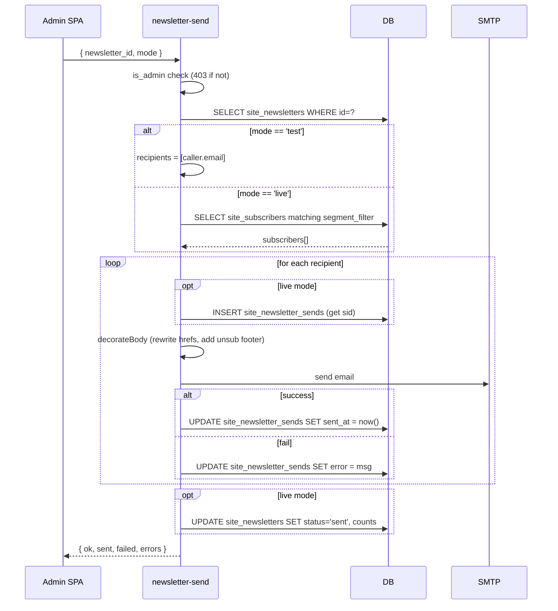

# newsletter-send

**POST** `/functions/v1/newsletter-send`

Admin newsletter blaster. Sends either a test (to the calling admin) or a live blast (to filtered subscribers).

## Request

```json
{
  "newsletter_id": "<uuid>",
  "mode": "test" | "live"
}
```

## Response

```json
{
  "ok": true,
  "mode": "live",
  "sent": 247,
  "failed": 2,
  "errors": ["alice@example.com: 451 mailbox unavailable", ...]
}
```

## Auth

- `verify_jwt: true`
- Inside body: checks `auth.getUser()` is non-null + [[is_admin]] RPC returns true → 403 otherwise

## Env vars

Reuses subscriber-send-confirmation's SMTP setup:
- `SMTP_HOST`, `SMTP_PORT`, `SMTP_USER`, `SMTP_PASS`
- `SUPABASE_URL`, `SUPABASE_SERVICE_ROLE_KEY`, `SUPABASE_ANON_KEY`

## Flow



## Link rewriting

Every `<a href="https://..."`> in body_html is rewritten to `https://<func>/newsletter-track-click?nid=<nid>&sid=<sid>&url=<encoded>`. The 302 redirect from [[newsletter-track-click]] records the click and forwards to the real URL.

## Unsubscribe footer

Each recipient's email gets a unique footer with their `unsubscribe_token` → `https://hilltrek.co.za/subscribe/unsubscribe/?token=<...>`.

## Consumers

- [[Hilltrek Admin Module]] `sendBlast(mode)` at `app.js:4004`

## See also

- [[Workflow - Newsletter]]
- [[site_newsletters]], [[site_newsletter_sends]]
