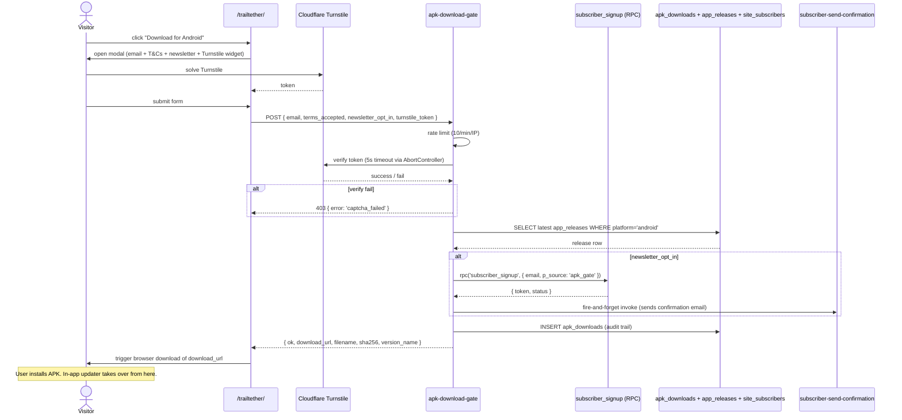

# Workflow - APK Download

Public-site flow for a visitor to download the Trailtether Android APK. Gated by T&Cs + Turnstile, optional newsletter opt-in.

## Components

- `hilltrek-site/trailtether/index.html` — the landing + modal
- [[apk-download-gate]] — server-side gate
- [[subscriber_signup]] + [[subscriber-send-confirmation]] — opt-in chain
- [[app_releases]] — the manifest table

## Tables

- [[app_releases]] — read
- [[apk_downloads]] — written (audit)
- [[site_subscribers]] — written if opt-in

## Privacy controls

- Email captured for newsletter opt-in is real (no hashing)
- IP recorded for abuse investigation (not hashed because this is legal-evidence audit, not analytics)
- IP country from `cf-ipcountry`
- UA stored but truncated to 500 chars

## Rate limit

10/min per IP. Each request even before reaching Turnstile/DB is rate-checked.

## See also

- [[Workflow - Release]] (how new APKs land in [[app_releases]] table)
- [[Audit Findings]] (Turnstile timeout fix already applied)
