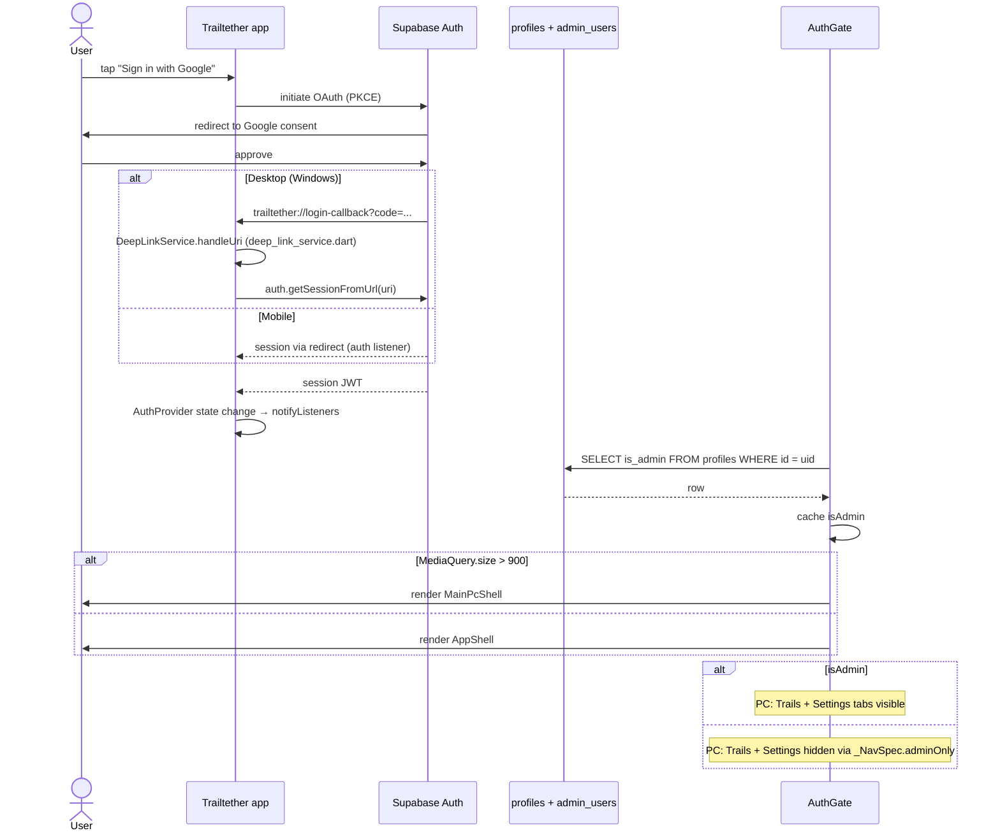

# Workflow - Auth

User sign-in → JWT → admin role detection → protected routes.

## Components in this flow

- [[main.dart]] — initialises Supabase + DeepLinkService
- [[AuthGate]] — routes based on auth state + screen size
- [[auth_provider.dart]] — owns `isAdmin` flag (refreshed from [[profiles]])
- [[deep_link_service.dart]] — Windows OAuth callback handler
- [[MainPcShell]] / [[AppShell]] — shells dispatched by [[AuthGate]]

## Tables involved

- `auth.users` (Supabase Auth's internal table — triggered by [[handle_new_user]] to populate [[profiles]] on first sign-up)
- [[profiles]] — `is_admin` column drives the flag
- [[admin_users]] — backing allowlist for [[is_admin]] RPC

## Critical pieces

- **`trailtether://` URL scheme** — registered in `pubspec.yaml` msix_config + Android intent-filter
- **`is_admin` is cached locally** in [[auth_provider.dart]] (`_isAdmin` field) and refreshed on every auth state change

## Edge cases

- New user → [[handle_new_user]] trigger creates the matching [[profiles]] row automatically
- Signed-in non-admin sees the same shell, just with admin tabs filtered out — see [[MainPcShell]]
- Sign-out clears local state (achievements, hike history) but Supabase data persists (cloud-first)

## See also

- [[is_admin]] RPC
- [[Workflow - Live Team Tracking]] (depends on signed-in user)
