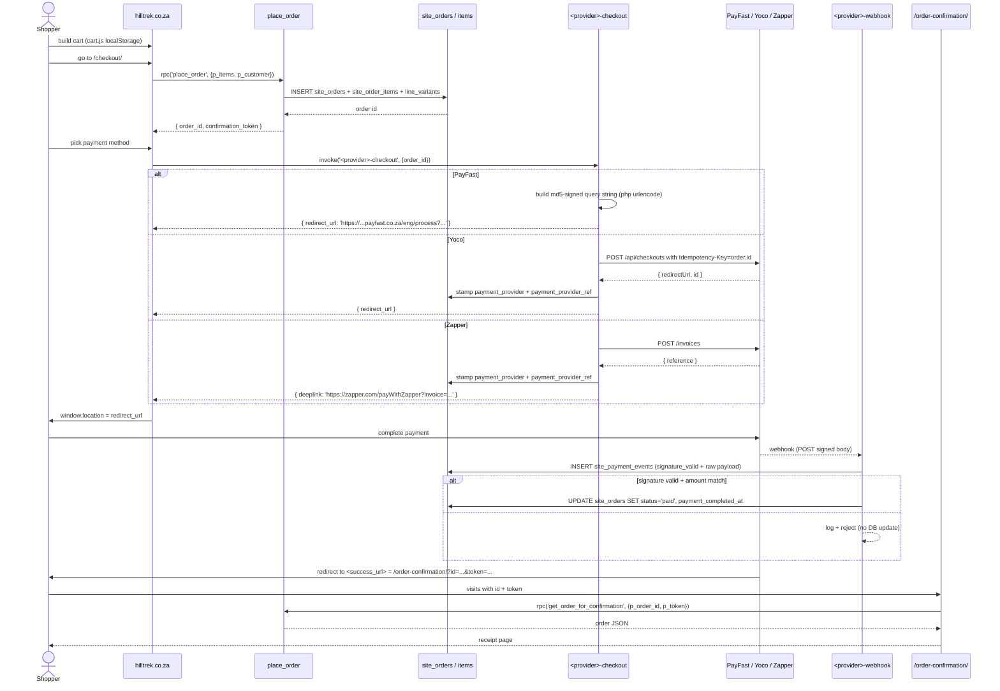

# Workflow - Checkout

Cart → place order → payment provider → webhook → confirmed receipt.

## Components

- [[Hilltrek Site Module]] — cart, checkout, order-confirmation pages
- [[cart.js]] — localStorage cart
- [[place_order]] RPC
- [[get_order_for_confirmation]] RPC
- One of [[payfast-checkout]] / [[yoco-checkout]] / [[zapper-checkout]] (per chosen method)
- Matching webhook: [[payfast-itn]] / [[yoco-webhook]] / [[zapper-webhook]]

## Tables

- [[site_orders]] — the order row
- [[site_order_items]] — line items snapshot
- [[site_payment_events]] — every webhook (valid or invalid)
- [[site_products]] — what the order references

## Authoritative source of order status

The webhook handlers are the **only** authoritative writer of `status` and `payment_completed_at`. The shopper's redirect to `/order-confirmation/` is a UI display, not a source of truth. If the shopper closes the browser before the redirect, the webhook still fires and the order updates.

## Triple verification on webhooks

Every webhook handler does:
1. Signature verify (md5 for PayFast, HMAC-SHA256 for Yoco/Zapper)
2. Amount match against `site_orders.total_cents`
3. (PayFast only) POST to `/eng/query/validate` for double-check
4. Idempotent skip if order already `paid` for same provider_ref

## See also

- [[Audit Findings]] for the CORS hardening that just landed on payfast/yoco
- [[Known Issues]] for the same issue still open on zapper-checkout
