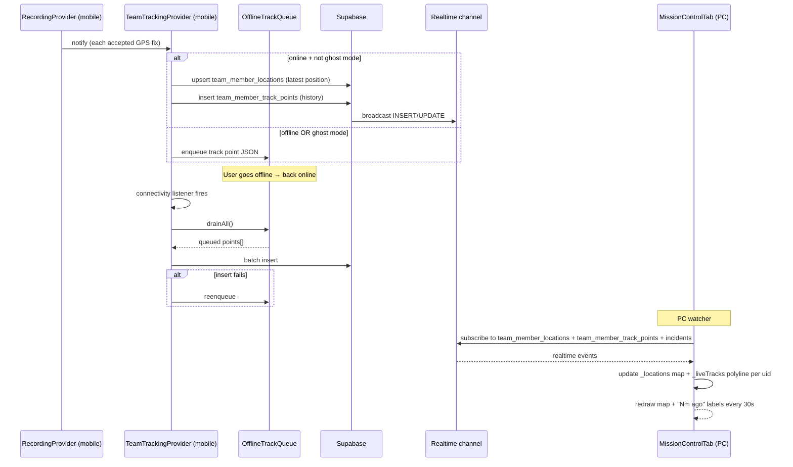

# Workflow - Live Team Tracking

Mobile hiker → Supabase Realtime → PC watcher in [[MainPcShell]]. Concurrent with [[Workflow - Record Hike]] — the same GPS stream feeds both.

## Components

- [[team_tracking_provider.dart]] — the mobile-side publisher
- [[offline_track_queue.dart]] — SharedPreferences-backed FIFO buffer (4000 cap)
- [[MissionControlTab]] — the PC-side subscriber + renderer
- [[recording_provider.dart]] — emits fixes (the source)

## Tables

- [[team_member_locations]] — latest position per (team, uid) — upsert, 3s throttle
- [[team_member_track_points]] — full history (append-only)
- Both pruned by `prune_old_locations()` / `prune_stale_telemetry()` cron jobs

## Ghost mode

When the user toggles ghost mode via [[recording_provider.dart]] `toggleGhostMode()`, `team_tracking_provider.dart` stops publishing. Teammates see stale data — no "left the room" notification. Reversible.

## Battery saver

Reduces publish frequency from 3s to 30s + uses `LocationAccuracy.medium`. Recording itself becomes less precise; team broadcasts also become less frequent.

## Failure modes

- **Offline drain failure**: queue re-enqueued. Retries on next connectivity tick.
- **Queue overflow**: 4000-item cap. Oldest dropped to make room.
- **Realtime channel disconnect**: [[MissionControlTab]] auto-reconnects via Supabase's built-in retry.

## Privacy

- Locations only visible to team members (RLS filters by `team_id` membership)
- Berg Live public leaderboard / heatmap requires opt-in per [[teams]].`is_public` — separate gate from team-internal tracking

## See also

- [[Workflow - Record Hike]] (the shared source of GPS fixes)
- [[Workflow - Auth]] (team membership required to be visible)
