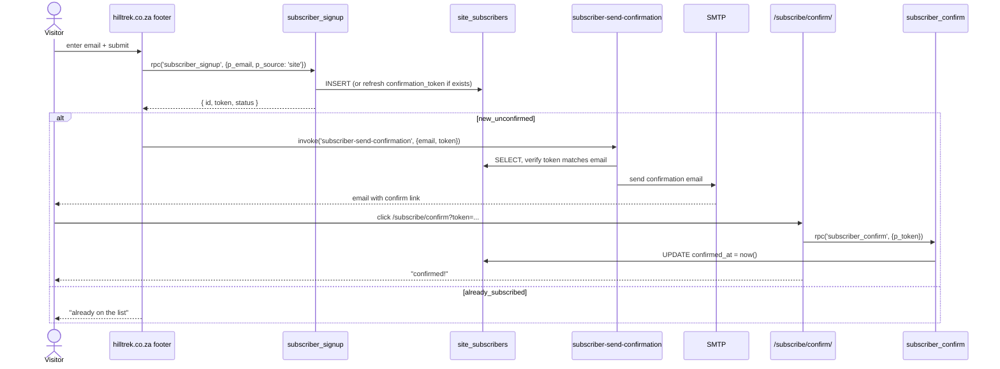
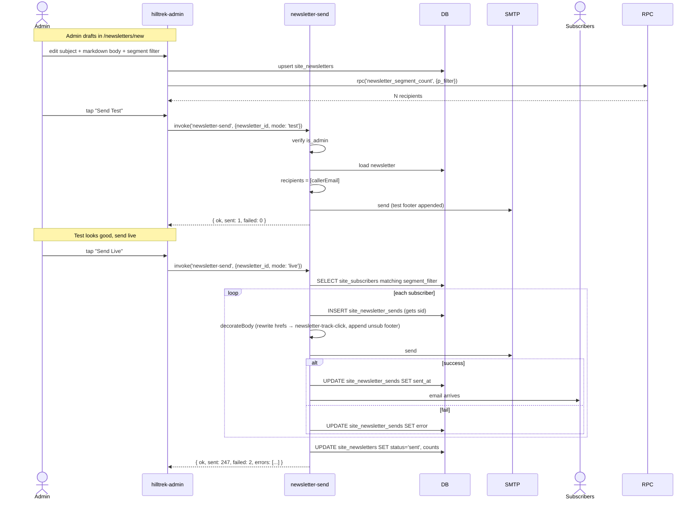
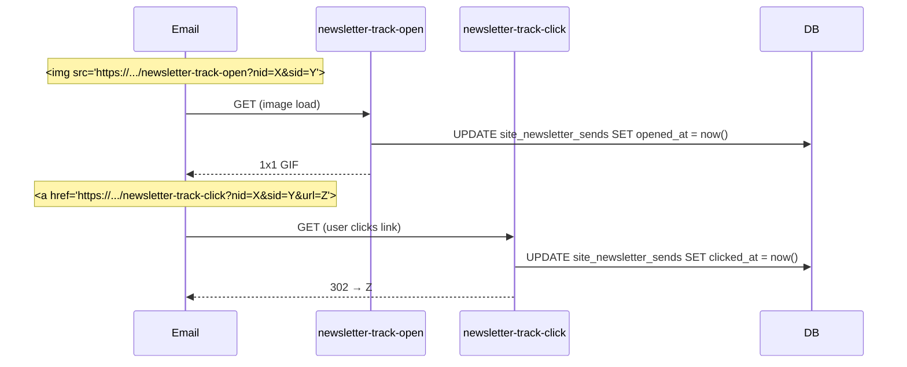

# Workflow - Newsletter

Three sub-flows: **subscribe**, **confirm**, **send blast**.

## Subscribe + confirm (public)

## Send blast (admin)

## Open + click tracking (downstream)

## Components

- [[subscribe.js]] (public footer)
- [[subscriber_signup]], [[subscriber_confirm]], [[subscriber_unsubscribe]] RPCs
- [[subscriber-send-confirmation]] (SMTP confirmation email)
- [[newsletter-send]] (blast)
- [[newsletter-track-open]], [[newsletter-track-click]] (analytics)
- [[Hilltrek Admin Module]] newsletter editor view
- [[newsletter_segment_count]] (preview count)

## Tables

- [[site_subscribers]] — the list
- [[site_newsletters]] — drafts + sent records
- [[site_newsletter_sends]] — per-recipient tracking

## See also

- [[denomailer]] — SMTP client used by both edge functions
