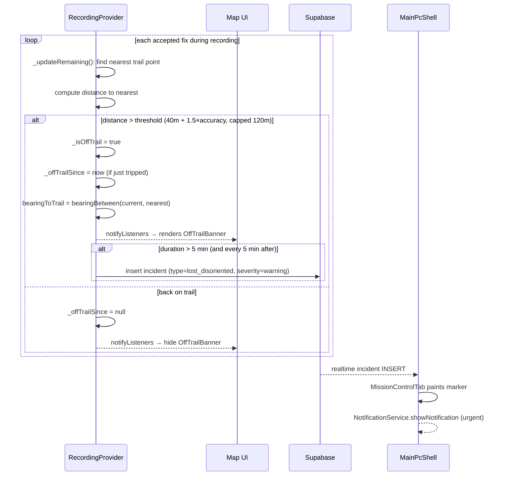

# Workflow - Off-Trail Alert

When a hiker drifts off the planned trail during recording. Shows a return arrow + after 5 minutes posts an [[incidents]] row so the command centre sees it.

## Components

- [[recording_provider.dart]] `_updateRemaining` (lines ~258-373) — the detection
- [[recording_provider.dart]] `_maybePublishOffTrailAlert` — incident insert (rate-limited 1/5min)
- [[LiveTrackingScreen]] — renders the OffTrailBanner with the return-arrow
- [[TTMapScreen]] — same banner via shared widget
- [[MissionControlTab]] — receives the incident via realtime channel

## Tables

- [[incidents]] — written with `type='lost_disoriented'`, `severity='warning'`, lat/lon, description with bearing direction

## Adaptive threshold

Default 40m, but adds 1.5× the current GPS accuracy as slack. Capped at 120m. This handles deep-valley GPS jitter so a single noisy fix doesn't trip a false off-trail alarm.

## Bearing back to trail

Compass-style direction: N / NE / E / SE / S / SW / W / NW. Displayed as a rotated arrow in the banner.

## Rate limit on incident inserts

`_lastOffTrailAlertAt` ensures we don't post more than one incident per 5 minutes per hiker. Without this, prolonged off-trail drift would spam the incidents table.

## Known issue

The current insert uses `unawaited(...catchError(...))` which silently swallows failures. Flagged in [[Audit Findings]] (P1) — should move to retry queue similar to [[Workflow - Live Team Tracking]]'s offline buffer.

## See also

- [[Workflow - Record Hike]]
- [[Workflow - Live Team Tracking]]
- [[Known Issues]]
