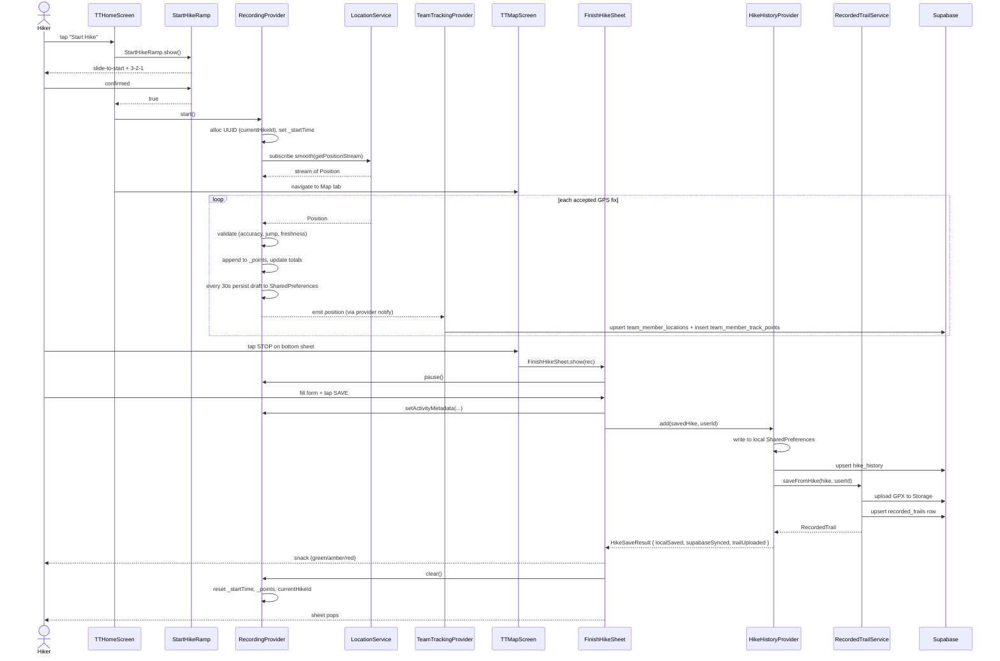

# Workflow - Record Hike

Start → record → finish → save. The heart of the app.

## Components in this flow

- [[StartHikeRamp]] — pre-recording ritual
- [[recording_provider.dart]] — the state machine
- [[location_service.dart]] — Geolocator wrapper with Kalman smoothing
- [[TTMapScreen]] — primary recording surface (Map tab)
- [[FinishHikeSheet]] — Save / Discard / Resume sheet
- [[hike_history_provider.dart]] — local + cloud persistence
- [[recorded_trail_service.dart]] — GPX upload + metadata row
- [[team_tracking_provider.dart]] — live tracking publisher (concurrent)

## Tables involved

- [[hike_history]] — finished hike row with full points (jsonb)
- [[recorded_trails]] — promoted-for-sharing metadata
- [[team_member_locations]] (live latest position)
- [[team_member_track_points]] (full live trail)
- [[community_activities]] — `hike_completed` row (non-fatal post)

## Models

- [[RecordingPoint]] (per-fix)
- [[SavedHike]] (per-finished-hike)
- [[RecordedTrail]] (per-shareable trail)

## Critical invariants

- `RecordingProvider._startTime == null` ↔ recording is truly idle (post-`clear()` only). After STOP-then-START with the old buggy flow, this stayed set and grafted new points onto the dead session. Now [[FinishHikeSheet]] always calls `clear()` after Save or Discard.
- **`currentHikeId` is allocated once per session** at `start()` and reused for both the [[SavedHike]].id and the `team_member_track_points.hike_id`. Critical for the recovery worker [[finalize-orphan-hikes]] to match orphan rows.

## Failure modes + recovery

| Failure | Recovery |
|---|---|
| App crashes during recording | Draft persisted to SharedPreferences every 30s. On next launch [[recording_provider.dart]] `_restoreDraft` re-hydrates state as `paused`. User picks Resume or Discard via [[FinishHikeSheet]]. |
| User force-closes without saving | [[team_member_track_points]] rows still in DB. [[finalize-orphan-hikes]] cron picks them up after `stale_hours` and creates a [[recorded_trails]] row "Recovered hike YYYY-MM-DD". |
| Offline at save time | `HikeSaveResult.localSaved=true`, `supabaseSynced=false`. Snack says "Saved on device only — sign in to sync". |
| Save succeeds but trail upload fails | Partial success. Snack says "Synced to your account, but trail file failed to upload. The hourly recovery job will retry." |

## See also

- [[Workflow - Off-Trail Alert]] (parallel safety thread during recording)
- [[Workflow - Live Team Tracking]] (parallel team broadcast)
