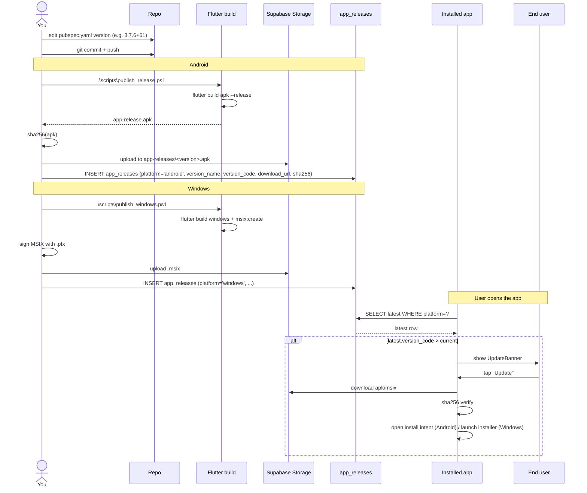

# Workflow - Release

Bump pubspec → run publish script → in-app updater picks up the new build.

## Components

- [[publish_release.ps1]] — Android
- [[publish_windows.ps1]] — Windows
- [[update_service.dart]] — in-app updater poll + download + verify
- `UpdateBanner` widget (`widgets/update_banner.dart`)
- `UpdateGate` (wraps the whole app in [[main.dart]])

## Tables

- [[app_releases]] — manifest
- (Storage: `app-releases` bucket)

## Public path

For visitors hitting hilltrek.co.za, the download goes through [[Workflow - APK Download]] which reads from the same [[app_releases]] table — keeps the website button and the in-app updater pointing at the same artifact.

## Critical: SHA-256 verify

Both the in-app updater and (implicitly, via download metadata) the web gate verify the SHA-256 of the downloaded APK against the row in [[app_releases]] before installing. Prevents tampering.

## Per-platform divergence

| Concern | Android | Windows |
|---|---|---|
| Storage path | `app-releases/trailtether-<v>.apk` | `app-releases/trailtether-<v>.msix` |
| Install trigger | `open_filex` opens Android package installer | OS launches MSIX installer |
| Verify | sha256 from row | sha256 from row |
| Signing | APK signed with stored keystore | MSIX signed with local personal Cert Store via thumbprint fallback (`DCEF755D97F906249E897EF8CA5CAB75BF71B300`) or raw `.pfx` |

> [!note] Non-Interactive Windows Signing
> The [[publish_windows.ps1]] script is hardened to detect if the code-signing certificate is already installed in the developer's local `Cert:\CurrentUser\My` store. If present, it passes the thumbprint to `msix:create` via `--signtool-options "/fd sha256 /sha1 $thumbprint"`, completely eliminating interactive password prompts during automated builds.

> [!note] User handles publishing
> Per project convention, the developer runs the publish scripts personally — Claude bumps the pubspec + commits, the developer runs `publish_release.ps1` + `publish_windows.ps1` themselves.

## See also

- [[Build & Deploy]]
- [[Scripts Module]]
- [[offline_incident_queue.dart]]
