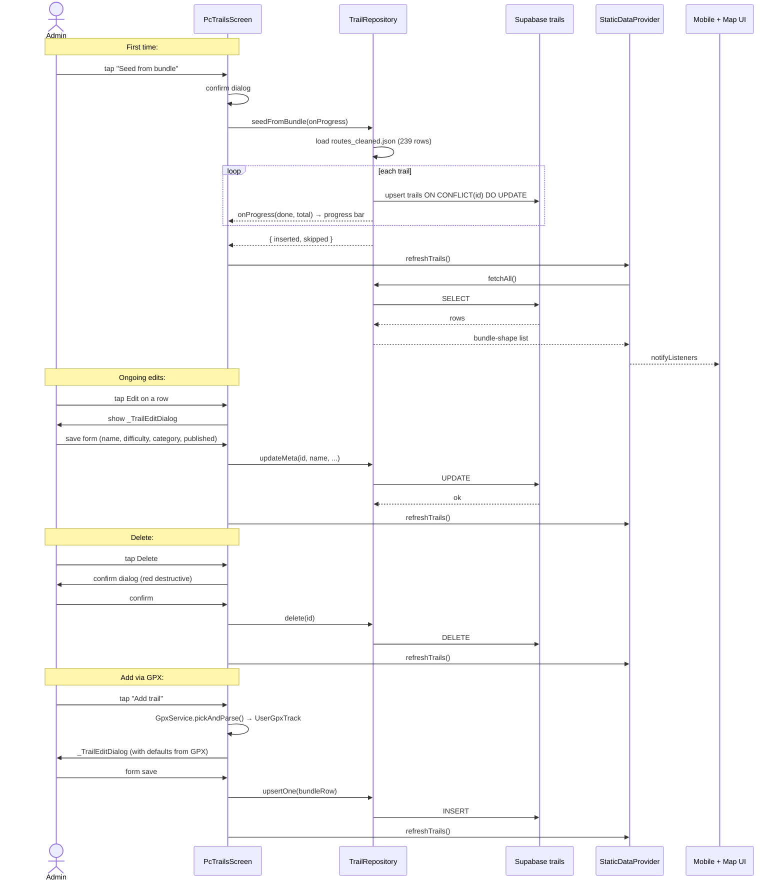

# Workflow - Trails CRUD

Admin's path to curate the [[trails]] catalogue on PC.

## Components

- [[PcTrailsScreen]] — UI
- [[trail_repository.dart]] — CRUD wrapper
- [[trail_service.dart]] — Supabase → cache → bundle loader (rebuilds cache on refresh)
- [[static_data_provider.dart]] — broadcasts to UI consumers
- [[gpx_service.dart]] — GPX file pick + parse

## Tables

- [[trails]] — single source of truth (Supabase)
- (legacy: `assets/data/routes_cleaned.json` — bundled fallback for first-launch / offline)

## RLS gating

- Anon / authenticated → SELECT WHERE `published = true`
- `is_admin()` → all rows + INSERT/UPDATE/DELETE

The PC UI is also gated at the **nav** layer: `_NavSpec.adminOnly: true` hides the Trails tab from non-admins (see [[MainPcShell]]). Two layers of defence.

## Performance note

`coords` columns can be large (1600-point trails ≈ 50KB per row). Total `trails` table size = ~700KB-1.2MB for the 239 rows. Reasonable.

## See also

- [[trail_service.dart]] cache → SharedPreferences key `trails_supabase_cache_v1`
- [[Audit Findings]] (Aasvoelkrans cosmetic issue addressed by this admin flow)
