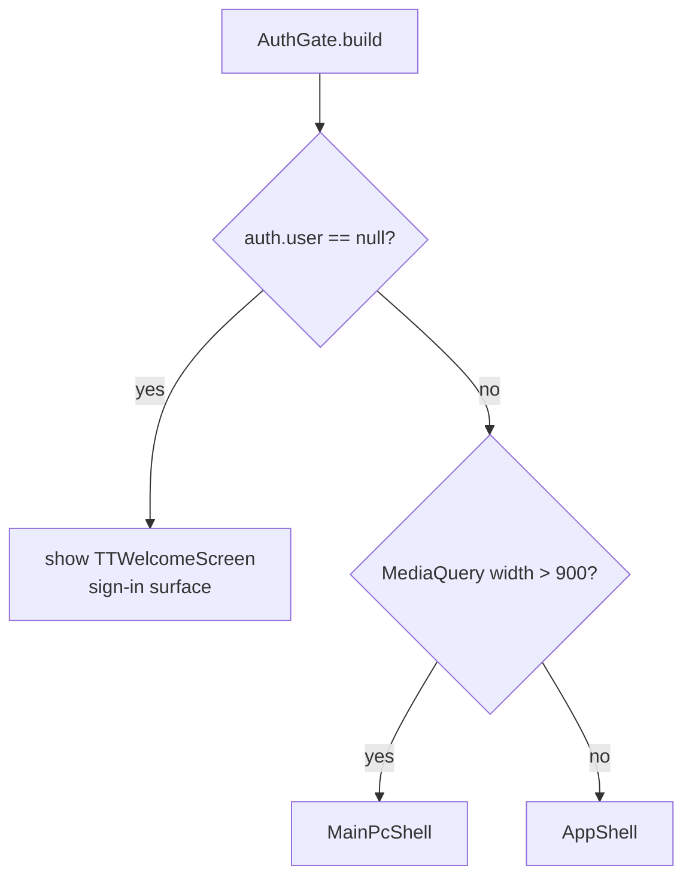

# AuthGate

The root post-auth router. Decides which shell renders based on auth state + screen size.

## Public surface

- `AuthGate({ super.key })` — used by [[main.dart]] inside `MaterialApp.home`

## Logic flow

Watches [[auth_provider.dart]] via `context.watch<ap.AuthProvider>()`. On auth state change, rebuilds → either `WelcomeScreen` (or one of the TT welcome variants) or one of the shells.

## Used by

- [[main.dart]] (wraps in `UpdateGate`)

## Depends on

- [[auth_provider.dart]] — for current user
- [[AppShell]] — mobile shell
- [[MainPcShell]] — desktop shell
- [[Workflow - Auth]]

## Side effects

- None directly. Auth state is owned by [[auth_provider.dart]].

## Key file

- `lib/screens/auth_gate.dart` (~80-90 LOC)
