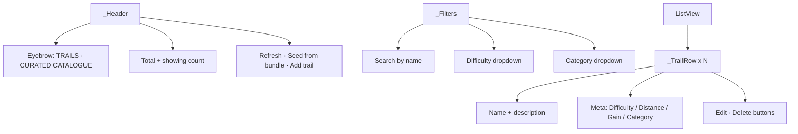

# PcTrailsScreen

Curated trail catalogue editor in [[MainPcShell]]. Admin-only.

## Sections

## Actions

| Action | Calls | Effect |
|---|---|---|
| Refresh | `StaticDataProvider.refreshTrails()` | Re-fetches from [[trails]] |
| Seed from bundle | `TrailRepository.seedFromBundle()` | Iterates bundled JSON, upserts into [[trails]]. Idempotent. Shows progress bar. |
| Add trail | `GpxService.pickAndParse()` + `_TrailEditDialog` + `TrailRepository.upsertOne()` | GPX upload → form → DB insert |
| Edit row | `_TrailEditDialog` + `TrailRepository.updateMeta()` | Updates name / difficulty / category / description / gain / published |
| Delete row | Confirm dialog + `TrailRepository.delete()` | Hard-delete from [[trails]] |

After every successful mutation: `context.read<StaticDataProvider>().refreshTrails()` so the change shows up across the app (map, list, search) without restart.

## Edit dialog (`_TrailEditDialog`)

- Name field (text)
- Difficulty dropdown (Easy / Moderate / Challenging / Hard / Extreme)
- Category dropdown (hike / cave / peak / circular / scramble)
- Elevation gain (m) — manual override
- Description (multiline)
- Published toggle

## Auth

The PC nav already filters [[PcTrailsScreen]] out for non-admins via `_NavSpec.adminOnly: true` in [[MainPcShell]]. Even if a non-admin somehow gets here, every mutation goes through [[trail_repository.dart]] → Supabase RLS gated by [[is_admin]]. Two layers of defence.

## Used by

- [[MainPcShell]] trails section (admin-only)

## Depends on

- [[trail_repository.dart]], [[static_data_provider.dart]], [[gpx_service.dart]]
- [[Trail Model]]
- [[TT Design Tokens]]

## Key file

- `lib/screens/pc/pc_trails_screen.dart` (~750 LOC including private dialog widgets)

## See also

- [[Workflow - Trails CRUD]]
- [[trails]] table schema
