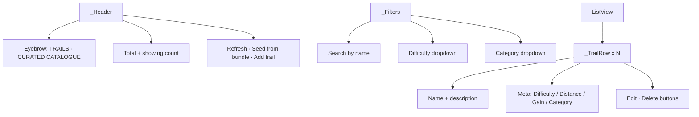

# PcTrailsScreen

Curated trail catalogue editor in [[MainPcShell]]. Admin-only.

## Sections

## Actions

| Action | Calls | Effect |
|---|---|---|
| Refresh | `StaticDataProvider.refreshTrails()` | Re-fetches from [[trails]] |
| Seed from bundle | `TrailRepository.seedFromBundle()` | Iterates bundled JSON, upserts into [[trails]]. Idempotent. Shows progress bar. |
| Add trail | `GpxService.pickAndParse()` + `_TrailEditDialog` + `TrailRepository.upsertOne()` | GPX upload → form → DB insert |
| Edit row | `_TrailEditDialog` + `TrailRepository.updateMeta()` | Updates name / difficulty / category / description / gain / published |
| Delete row | Confirm dialog + `TrailRepository.delete()` | Hard-delete from [[trails]] |

After every successful mutation: `context.read<StaticDataProvider>().refreshTrails()` so the change shows up across the app (map, list, search) without restart.

> [!warning] Seed first; seeding reintroduces duplicates (2026-05-29)
> While [[trails]] is *empty*, [[trail_service.dart]] serves the read-only bundled JSON — so edits/deletes silently no-op (they hit nonexistent DB rows). Seed before editing. But the bundled `routes_cleaned.json` carries ~29 routes twice (hyphen-id + underscore-id twins), so "Seed from bundle" re-adds duplicates that were cleaned out (catalogue deduped to 197 unique on 2026-05-29). Don't re-seed until the bundle asset is cleaned.

## Edit dialog (`_TrailEditDialog`)

- Name field (text)
- Difficulty dropdown (Easy / Moderate / Challenging / Hard / Extreme)
- Category dropdown (hike / cave / peak / circular / scramble)
- Elevation gain (m) — manual override
- Description (multiline)
- Published toggle

## Auth

Two **independent** admin signals gate this screen — and they must agree:
- **Tab visibility:** [[MainPcShell]] hides this tab unless `profiles.is_admin` is true (`_NavSpec.adminOnly`, cached in [[auth_provider.dart]]).
- **Write permission:** every mutation goes through [[trail_repository.dart]] → Supabase RLS gated by [[is_admin]](), which checks the [[admin_users]] allowlist.

> [!warning] Split-brain gotcha (2026-05-29)
> If an account has `profiles.is_admin=true` but no [[admin_users]] row, the editor *shows* and (pre-fix) reported "Saved", but RLS silently filtered every write to 0 rows. Set **both**. `updateMeta`/`delete` now `.select()` the affected rows and report a real failure instead of a false success. Editing difficulty / elevation gain also now persists (see [[Trail Model]] — stored values win).

## Used by

- [[MainPcShell]] trails section (admin-only)

## Depends on

- [[trail_repository.dart]], [[static_data_provider.dart]], [[gpx_service.dart]]
- [[Trail Model]]
- [[TT Design Tokens]]

## Key file

- `lib/screens/pc/pc_trails_screen.dart` (~750 LOC including private dialog widgets)

## See also

- [[Workflow - Trails CRUD]]
- [[trails]] table schema
