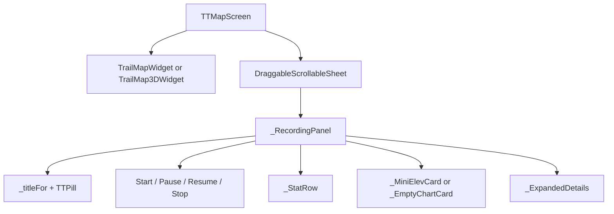

# TTMapScreen

Mobile Map / "Peak Tracker" tab. Big map up top, draggable bottom sheet with recording stats.

## Composition

## Recording controls

The bottom-sheet header shows different buttons based on [[recording_provider.dart]] state:

| State | Buttons shown |
|---|---|
| idle (no points) | `_StartButton` |
| recording | `_PauseButton` + `_StopButton` |
| paused | `_ResumeButton` + `_StopButton` |

`_StopButton` calls `FinishHikeSheet.show(context, recording)` — **NOT** `recording.stop()` directly. This is the Strava-style flow: STOP forces a Save / Discard / Resume decision before clearing state. See [[Workflow - Record Hike]].

## Stat row (`_StatRow`)

Three tiles — **Alt** (current altitude with `+gain m` subtitle), **Pace** (avg speed), **Time** (elapsed). The Alt tile falls back to "—" when `recording.points.last.altitude == 0`, so the user sees explicit "no vertical fix" rather than a stuck 0.

## 3D toggle

Header has a "3D" pill. When active, swaps `TrailMapWidget` for `TrailMap3DWidget` (MapLibre GL via WebView) — see [[TrailMap3DWidget]].

## Layer controls

Floating right column: GPS recenter, layers, units toggle, drop-pin mode, search.

## Drop-pin mode

When toggled, the next tap on the map opens a `FieldIntelSheet` (incident / hazard / shelter / water source quick-report).

## Used by

- [[AppShell]] (tab 1)

## Depends on

- [[recording_provider.dart]], [[static_data_provider.dart]], [[safety_provider.dart]], [[units_provider.dart]], [[gpx_provider.dart]]
- [[TrailMapWidget]], [[TrailMap3DWidget]], [[FinishHikeSheet]]
- [[StartHikeRamp]] (`_startRecording`)
- Cave/incident/accommodation marker layers from [[Flutter Widgets Module]]
- [[TT Design Tokens]]

## Side effects

- Map controller tracks user location for recenter
- `_entryCtl` (TickerProviderStateMixin) animates the sheet on first frame

## Key file

- `lib/screens/tt_map_screen.dart` (~2300 LOC — includes many private widgets)
