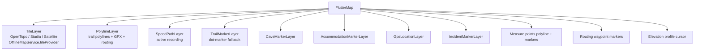

# TrailMapWidget

The 2D map composite. flutter_map FlutterMap + the layer stack used everywhere a 2D map appears (TTMapScreen, MissionControlTab, etc.).

## Stack

## Trail polyline rendering

Each trail draws two polylines:
1. **Glow layer** — wide, low-alpha (0.15 normal / 0.3 selected)
2. **Core layer** — thin, high-alpha (0.7 normal / 1.0 selected)

Caves get brown color (`0xFF8D6E63`) + dotted pattern + 2.0 stroke; other trails get orange + solid + 1.8-3.5 stroke. This is where the Aasvoelkrans "missing" visibility complaint originates — see [[Audit Findings]].

## Initial camera fit

`_initialCameraFit` memoized — sweeps all trail bboxes + GPX bboxes once at first build, fits CameraFit.bounds with 36 px padding. Doesn't re-sweep on rebuild.

## Map tap behaviour

Routes to the right callback based on mode:
- `measureMode` → `onMeasureTap`
- `routingMode` → `onRoutingTap`
- `incidentMode` → `onMapTapForIncident`
- Otherwise: nearest-trail proximity hit-test (150m threshold). Falls back to GPX track if a user GPX is nearer.

## Props

Roughly 20 named parameters — controller, callbacks, mode flags, measure points, marker overlays. All optional except `controller` + `onTrailTap`.

## Used by

- [[TTMapScreen]]
- [[MissionControlTab]] (2D mode)
- [[LiveTrackingScreen]] (2D mode)
- Older `map_screen.dart` (now deleted)

## Depends on

- [[static_data_provider.dart]], [[gpx_provider.dart]], [[recording_provider.dart]], [[routing_provider.dart]]
- [[offline_map_service.dart]] for tile caching
- [[TrailMarkerLayer]], [[SpeedPathLayer]], CaveMarkerLayer, IncidentMarkerLayer, AccommodationMarkerLayer, GpsLocationLayer

## Key file

- `lib/widgets/map/trail_map_widget.dart` (~490 LOC)
