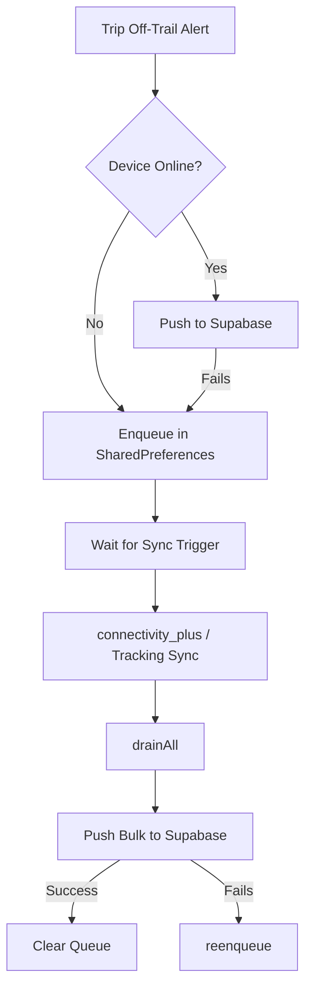

# `offline_incident_queue.dart`

Persistent local FIFO queue for off-trail incident alerts that couldn't be pushed to Supabase because the device was offline. It utilizes a `SharedPreferences`-backed JSON list.

## Core Logic

The service provides static methods to enqueue, count, and drain failed off-trail incident alert payloads. If connectivity is restored, the queue is drained and pushed to Supabase. If the push fails, it re-queues them.

## Methods

| Method | Return Type | Description |
|---|---|---|
| `enqueue(Map<String, dynamic> incident)` | `Future<void>` | Encodes and appends the incident payload to the SharedPreferences list (capped at `_maxItems = 100` to prevent excessive space usage). |
| `drainAll()` | `Future<List<Map<String, dynamic>>>` | Returns all queued incident maps and clears the SharedPreferences key to prevent duplicate uploads. |
| `reenqueue(List<Map<String, dynamic>> incidents)` | `Future<void>` | Prepends failed uploads back to the front of the queue to maintain ordering. |
| `count()` | `Future<int>` | Returns the active number of queued incident alerts. |

## Dependencies

- [[SharedPreferences]] — backing storage for persistent list serialization.
- [[logger_service.dart]] — logging queue size and sync status under the tag `OFF_TRAIL`.

## Used by

- [[recording_provider.dart]] — enqueues incident alerts in `_maybePublishOffTrailAlert` when network insertion fails.
- [[team_tracking_provider.dart]] — periodically drains the queue and synchronization attempts it alongside location tracking updates.

## See also

- [[Workflow - Off-Trail Alert]]
- [[Workflow - Live Team Tracking]]
- [[offline_track_queue.dart]]
